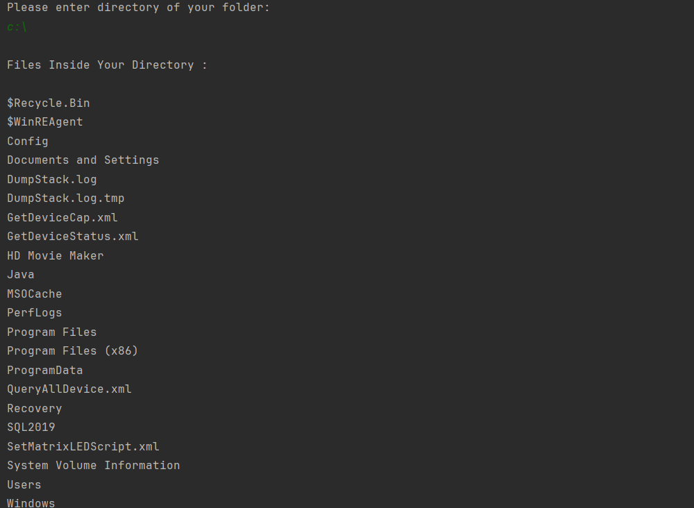

# Searching Duplicate Files With SHA-256

This project steps:
1) Enter your directory
2) Control the last line for how much match

This program uses SHA-256 PROTOCOL (SHA: Secure Hash Algorithm)

# PROGRAM PROCEDURE
-----------------------------------------------------
0) START PROGRAM
1) Searhing files about your entry directory
2) Adds names to linked list
3) These names are hashes with the SHA-256 Algorithm
4) These hashes entry adds to nodes
5) These nodes hashes compares
6) Last step is calculates how much matches
7) END PROGRAM
-----------------------------------------------------
## Output of program is below as you see

  
